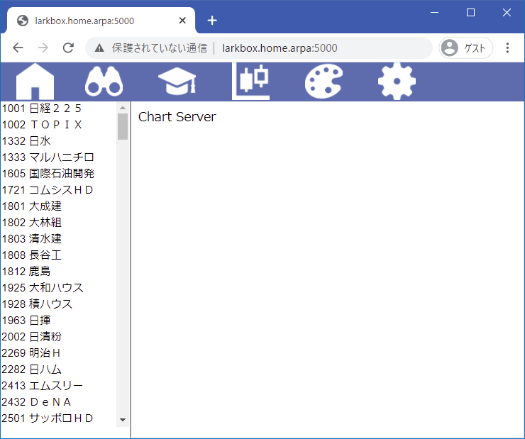
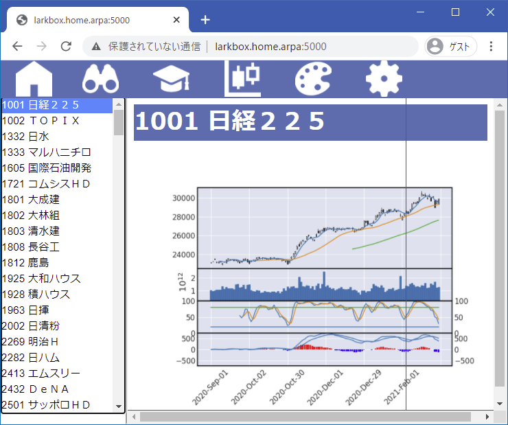
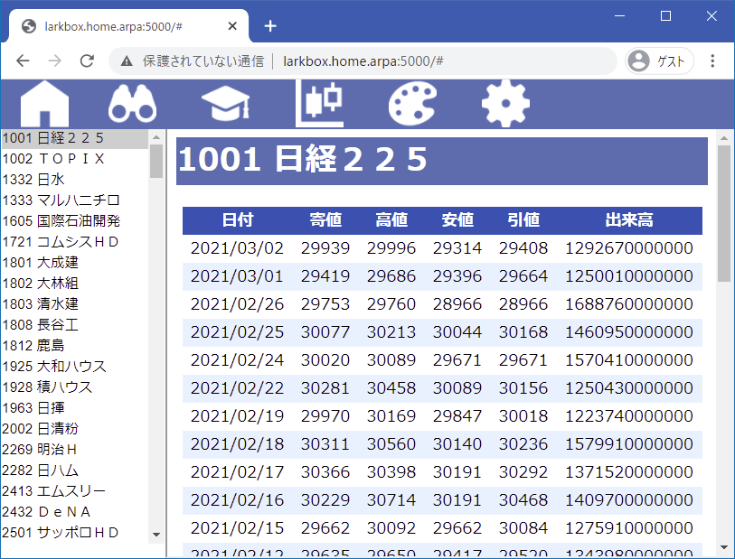
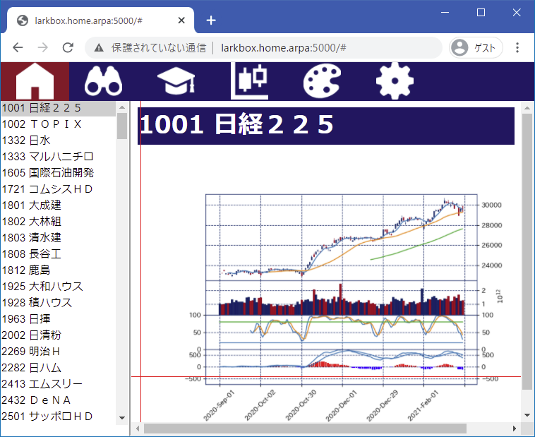
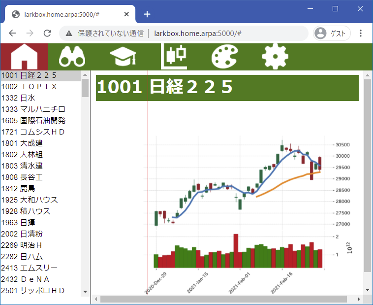

# はじめに

株価チャートを見るには、「Yahoo! Finance.」等の専門サイトや証券会社の提供するツールを利用するのが一般的ですが、例えば、秘密のスクリーニングを行ったり、トレーディングアルゴリズムの評価のためにバックテストを行ったりするために、自前で株価データを保持している場合、その自前の株価データでチャートを表示出来たら便利ですよね。

デスクトップで稼動する株価チャートアプリは、過去に胡散臭いものがたくさん存在していました（21世紀の今でも存在している？）が、ここで紹介するのは、SafariやChromeやEgdeなどのWebブラウザでチャートを表示させるツールです。株価データはLinuxサーバに置いておけば、どこからでもWebブラウザでチャートが見れる優れものです。

とはいっても、Linuxは敷居が高いと感じておられる方もおられるかと思いますので、macやwindows単独で、あたかもデスクトップアプリの感覚で使えるインストール方法も紹介します。

<a href="https://saturday-in-the-park.herokuapp.com/">デモサイトはこちらです。</a>データは最新ではありませんが、一通り試せます。

# インストール

### インストールの前提条件

+ docker, docker-composeをインストール済みであること。
+ gitをインストール済みであること。
+ 5000番ポートが開いていること。

macやwindows単独であっても、git, docker（docker Desktop推薦）をインストールしていれば、普通にインストール可能です。

IT技術者なら、この前提条件をクリアするのは容易でしょうが、一般のmac、windowsユーザの場合は敷居が高く感じられるかもしれません。その場合、<a href="https://saturday-in-the-park.netlify.app/TradingTools/ChartServer/#デスクトップインストール">Virtualbox+Vagrantを使用し、mac、windows単独でインストールする方法</a>を紹介します。

### リポジトリからソース取得

~~~
$ git clone https://github.com/etekichi98/chart_v2_demo.git
~~~

取得ソースのディレクトリ構成

~~~
chart_v2_demo/
    opt/
        muzinzo/  # 株価チャート生成用私設パッケージ
            __init__.py
            ....
        share/
            data/ # 株価データフォルダー
                1000/
                    1001.csv
                    ...
                2000/
                ...
                9000/
                    ...
                    9984.csv
                lists/   # ウォッチリストフォルダー(1)
                    xxxx.txt
                    ....
                watches/ # ウォッチリストフォルダー(2)
                    yyyy.txt
                    ....
                kdic.csv
        static/
            css/    # チャート表示Webアプリ用css
            images/ # チャート表示Webアプリ用アイコン
        templates/  # チャート表示Webアプリ用html
        app.py      # チャート表示Webアプリ本体
    docker-compose.yml
    Dockerfile
~~~

### 株価データcsvファイル

株価データフォルダーには、証券コードの1000の位ごとにサブディレクトリを切り、その中に「証券コード.csv」の名前のcsvファイルを置きます。

例

~~~csv:1301.csv
2015/01/05,275,277,274,275,239000000
2015/01/06,274,275,270,272,480000000
2015/01/07,270,273,270,271,217000000
  ...
2020/11/25,2839,2846,2795,2831,27800000
2020/11/26,2820,2826,2801,2809,8700000
2020/11/27,2807,2825,2803,2819,22000000
~~~

### ウォッチリストファイル

ウォッチリストフォルダーはlistsとwatchesの2系統用意しています（使い方は自由）。ウォッチリストフォルダーには、「ウォッチリスト名.txt」の名前のcsvファイルを置きます。

例

ウォッチリスト1.txt

~~~
7186,コンコルディア
8303,新生銀行
8304,あおぞら銀行
8306,三菱UFJ
8308,りそな
8309,三井住友トラスト
8316,三井住友F
8331,千葉銀行
8354,ふくおか
8355,静岡銀行
8411,みずほ
~~~

### サーバー起動

~~~
$ cd  chart_v2_demo
$ docker-compose up -d --build
~~~

### 動作確認

ブラウザから、

http://サーバー名:5000/

にアクセスし、以下のトップページが表示されれば成功。

# 使用方法

### メニュー

HOMEメニュー：トップページに戻ります。

ウォッチリスト(1)：ウォッチリストを選択します。

ウォッチリスト(2)：ウォッチリストを選択します。

チャートメニュー：チャート表示と時系列表示を切り替えます。

スタイルメニュー：チャートの配色を変更します。

設定メニュー：表示期間、補助チャート有無を指定します。

左側の銘柄リストをクリックすると、株価チャートが表示されます。

チャートメニュー＞時系列 で時系列データを表示します。

スタイルメニュー＞各種スタイル でチャートの配色を変更します。

設定メニューで好みのチャート表示に変更できます。

# デスクトップインストール

本節では、VirtualBoxとVagrantを使用した、macやwindows単体の環境でのインストール方法を紹介します。

(1) macまたはwindowsにVirtualBoxをインストールします。

<a href="https://www.virtualbox.org/">ここからVirtualBoxをダウンロードし、</a>ふつうにインストーラーでインストールします。

(2) macまたはwindowsにVagrantをインストールします。

Vagrantは「ベイグラント」と読みます。

<a href="https://www.vagrantup.com/">ここからVagrantをダウンロードし、</a>ふつうにインストーラーでインストールします。インストール後、再起動します。

(3) 適当な名前で作業ディレクトリを用意します。

例えば、 
ドキュメント\Vagrant\ChartServer

(4) テキストエディタでVagrantfile, provision.shという名前の２つのファイルを作業ディレクトリ内に作成します。

~~~Vagrantfile:title=Vagrantfile
Vagrant.configure("2") do |config|
  config.vm.box = "generic/alpine312"
  config.vm.hostname = "chartserver"
  config.vm.network "private_network", type: "dhcp"
  config.vm.provision :shell, :path => "./provision.sh"
end
~~~

~~~sh:title=provision.sh
sudo apk add docker docker-compose git
sudo service docker start
sudo rc-update add docker boot
sudo git clone https://github.com/etekichi98/chart_v2_demo.git
cd chart_v2_demo
sudo docker-compose up -d --build
~~~

(5) VagrantでChartServerを稼働させる仮想マシンを起動します。

~~~bash
$ vagrant up
~~~

コマンドはたった1行なのですが、Linux仮想マシンをリポジトリから持ってきて、必要なソフトをインストールするので、数分～数10分かかります。

以上でサーバが起動します。

(6) サーバのipアドレスを確認する

~~~bash
$ vagrant ssh
chartserver:~$ ip a|grep "inet "
    inet 127.0.0.1/8 scope host lo
    inet 10.0.2.15/24 scope global eth0
    inet 172.28.128.3/24 scope global eth1  # ←これ
    inet 172.19.0.1/16 brd 172.19.255.255 scope global br-4e2b369489cd
    inet 172.17.0.1/16 brd 172.17.255.255 scope global docker0
chartserver:~$ [Ctrl-D]
~~~

(7) ブラウザで株価チャート表示

あとは、ブラウザから、確認したipアドレスでアクセスすれば、株価チャートが表示されます。

http://172.28.128.5:5000/

(8) 後始末

動作確認を終えたら、

~~~bash
$ vagrant halt
~~~

試用を終えて、仮想マシンを完全に削除するには、

~~~bash
$ vagrant destroy
~~~

# まとめ

自前の株価データをサーバに置き、Webブラウザで株価チャートを表示するツールのインストール方法を紹介しました。

