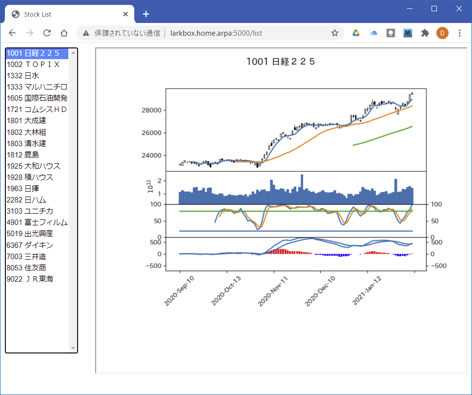

# 株価チャート配信サーバの使い方

解説記事はこちら：

https://saturday-in-the-park.netlify.app/TradingTools/08_ChartServer/

株価チャート配信サーバを起動する
~~~
$ cd chart_demo
$ docker-compose up -d --build
~~~

次のurlを叩くと、ブラウザに以下のの画面が出る

http://サーバ:5000/list

個別のチャートのurlは、以下のようなかんじ

http://サーバ:5000/candle?code=1332&term=100&volume=True

